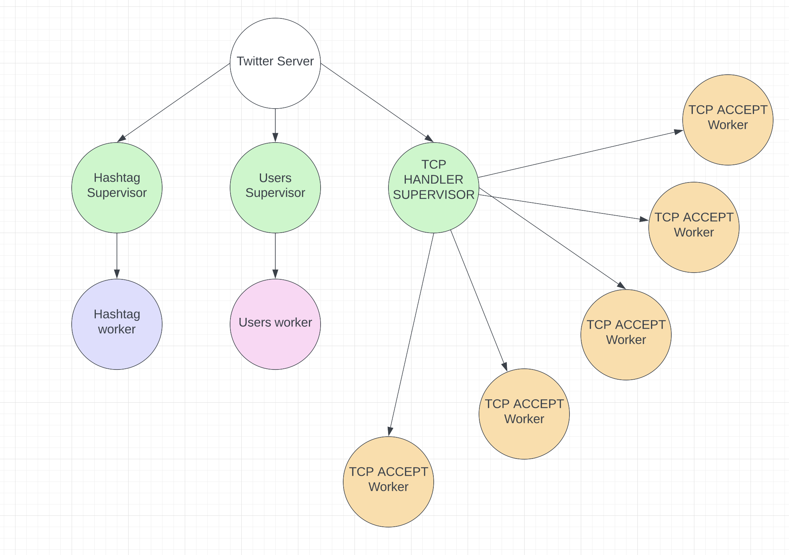
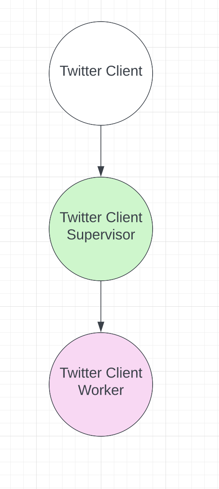

# TWITTER CLONE
Erlang twitter engine, server and client

# Authors
Tomas Delclaux Rodriguez-Rey and Ariel Weitzenfeld

# Introduction
The project consists of a twitter clone in erlang. There is a server to process requests and a client to send them.

The server supports:
- Registering new users
- Connecting users that have been previously registered
- Subscribing to users
- Sending tweets to subscribed users
- Retweeting
- Querying for received tweets
- Querying for tweets containing a given hashtag #
- Querying for tweets containing a given user mention @

# Architecture
Both the twitter client and server are OTP applications and follow OTP supervision tree structure.

## Twitter Server
It consits of three supervisors:
- A supervisor for the actor in charge of user data
- A supervisor for the actor in chager of tweets data
- A supervisor for the actors accepting tcp connections from clients

The OTP tree for this application can be seen in the screenshot below:



## Twitter Client
It consists of a single supervisor monitoring the client process.



# Running the Server
The server can be run using rebar3. For information on rebar3:
https://github.com/erlang/rebar3

The following commands are used for compiling and running the server:

```
example@example-Pro ErlTwitter % cd twitter
example@example-Pro twitter % ../rebar3 shell
===> Verifying dependencies...
===> Analyzing applications...
===> Compiling twitter
Erlang/OTP 25 [erts-13.1.1] [source] [64-bit] [smp:10:10] [ds:10:10:10] [async-threads:1] [jit] [dtrace]

Eshell V13.1.1  (abort with ^G)
1> users server started
tweets server started
Twitter server started
Twitter server started
Twitter server started
Twitter server started
Twitter server started
```

# Running the Client
The client can be run as a standalone or application. Additionally the client
can also execute the simulation program to start many client processes which connects to the server.

## Standalone application
The following scenarios shows three clients connecting to the server:

### Example 1 (Subscribing and Tweeting)

#### Client 1 fred
```
1> gen_server:cast(twitterClient_client,{register, "fred"}).
Sending User fred to be registered 
ok
2> New User fred registered

2> gen_server:cast(twitterClient_client,{tweet, "Hello world"}).
ok
3> 
3> gen_server:cast(twitterClient_client,{subscribe, "tom"}).    
ok
4> fred subscribed to tom

4> Tweet: 2
From: tom
Text: Hello, I am Tom
```

#### Client 2 Tom

```
1> gen_server:cast(twitterClient_client,{register, "tom"}). 
Sending User tom to be registered 
ok
2> New User tom registered

2> gen_server:cast(twitterClient_client,{subscribe, "fred"}).
ok
3> tom subscribed to fred

3> Tweet: 1
From: fred
Text: Hello world

3> 
3> gen_server:cast(twitterClient_client,{subscribe, "Hello, I am Tom"}).
ok
4> tom unable to subscribe to Hello, I am Tom

4> gen_server:cast(twitterClient_client,{tweet, "Hello, I am Tom"}).    
ok
```

#### Client 3 Martha

```
1> gen_server:cast(twitterClient_client,{register, "martha"}).
Sending User martha to be registered 
ok
2> New User martha registered

2> gen_server:cast(twitterClient_client,{subscribe, "fred"}).  
ok
3> martha subscribed to fred

3> Tweet: 1
From: fred
Text: Hello world
```

### Example 2 (Retweeting)

#### Client Tom
```
3> tom subscribed to fred

3> Tweet: 1
From: fred
Text: Hello world

5> gen_server:cast(twitterClient_client,{retweet, 1}).                
```

#### Client Fred (gets back his original message from re-tweet)
```
3> gen_server:cast(twitterClient_client,{subscribe, "tom"}).    
ok
4> fred subscribed to tom

4> Tweet: 1
From: fred
Text: Hello world
```

### Example 3 (Queries)

#### Client Martha

Getting tweets where the user is mentioned
```
3> gen_server:cast(twitterClient_client,{get_mention}).      
ok
4> Tweet: 3
From: fred
Text: Hello world @martha
Tweet: 4
From: fred
Text: Hi @martha is the best
```

Getting tweets subscribed to
```
5> gen_server:cast(twitterClient_client,{get_my_tweets}).        
ok
6> Tweet: 1
From: fred
Text: Hello world
Tweet: 3
From: fred
Text: Hello world @martha
Tweet: 4
From: fred
Text: Hi @martha is the best
Tweet: 5
From: fred
Text: Thos #monsters are scary
```

Getting tweets with a specific hashtag
```
4> gen_server:cast(twitterClient_client,{get_hash, "#monsters"}).
ok
5> Tweet: 5
From: fred
Text: Thos #monsters are scary
Tweet: 6
From: tom
Text: Hello, I am a #monsters
```

### Example 4 (Miscellaneous)
Disconnecting and Reconnecting
State is kept in server if it hasnt been restarted.

```
6> gen_server:cast(twitterClient_client,{disconnect}).   
ok
7> gen_server:cast(twitterClient_client,{connect, "martha"}).
ok
8> martha connected

8> gen_server:cast(twitterClient_client,{get_my_tweets}).    
ok
9> Tweet: 1
From: fred
Text: Hello world
Tweet: 3
From: fred
Text: Hello world @martha
Tweet: 4
From: fred
Text: Hi @martha is the best
Tweet: 5
From: fred
Text: Thos #monsters are scary
```
## Simulation
The simulation is a program that is located inside the twitterClient and thus can be also run with rebar3. See below:

Starting simulation
```
9> simulation:start(20).
starting client connection...
Sending User 20 to be registered 
New User 20 registered
starting client connection...
Sending User 19 to be registered 
```

Stopping simulation to print results
```
10> simulation:stop().
Users: 20
Tweets: 15
ReTweets: 10
Connections: 15
Simulation Time(mins): 1.0323200766333334
```

# Results
The capacity of the server depends greatly on the number of actor processes that
are spawned, in particular to handle the tcp connections.

It was possible to configure the twitter_server_sup process to run with 500 tcp handling workers and thus run the simulatio for 400 users. This was done running all processes for client and server on a macbook pro m1.

Greater performance can be seen using more tcp handlers, which can be adjusted on
the following line of the file twitter_server_sup.erl:

```
empty_listeners() ->
  [start_socket() || _ <- lists:seq(1,500)],
  ok.
```

The simulation was then run using:
```
2> simulation:start(400).
```

The simulation takes into account users with many subscribers tweeting more than the rest, and also takes into consideration periods of live connections and periods where the user is disconnected. Additionally, the number of subscribers each user has follows a zipf distribution where the firt user has the most subscribers, the next one half of the first, the next one a third, then a fourth and so on.

```
Periods=lists:nth(rand:uniform(?NUM), ?PERIODS),
State=#state{id=NumNodes, periods=Periods, subscribers=round(TotalNodes/I), period=1, time=0, disc=true},
start(NumNodes, State),
start_clients(NumNodes-1, I+1, TotalNodes).
```

It does this by specifying the amount of subscribers above which a user would be a frequent tweeter in the simulation, and also using a list with integers representing minutes where the user is connected and active. The integers that are negative represent time intervals where the user is inactive.

In simulation.erl this parameters are defined here:

```
-define(MANYSUBS, 40).
-define(PERIODS, [[5,-1,15, -2,10], [-2,13,-3,8,10], [4,-1,1,-8,15],[2,-1,7,-3,17],[1,15,-4,11,-1]]).
-define(NUM, 5).
```

# Performance

## Capacity metrics

As it can be seen in the output below, the server can withstand 400 users performing over 4000 connections in over 15 minutes, and sending more than 4000 
tweets in that time, with 250 retweets. This high capacity is due to the many tcp handlers which process server requests.

```
2> simulation:stop().
Users: 400
Tweets: 4194
ReTweets: 253
Connections: 4066
Simulation Time(mins): 16.91827317285
** exception exit: killed
```

## Fault Tolerance
Additionally the code was measured for tolerance, which is just as important in measuring performance as is capacity.

In order to this, with a capacity of 500 tcp handlers, three sperate shells were
run; each one running the client simulator with a number of client processes.

This example was run with the following parameters:

- Shell 1: simulation:start(300)
- Shell 2: simulation:start(50)
- Shell 3: simulation:start(50)

The process in shell 1 was kep running, whilst stopping the other two abruptly showing that the application for the client in shell 1 and the server still run

#### Shell 1 (start)
```
1> simulation:start(300).
starting client connection...
Sending User 300 to be registered 
New User 300 registered
starting client connection...
Sending User 299 to be registered 
New User 299 registered
starting client connection...
Sending User 298 to be registered 
New User 298 registered
starting client connection...
```

#### Shell 2 (start)
```
1> simulation:start(50).
starting client connection...
Sending User 50 to be registered 
New User 50 registered
starting client connection...
Sending User 49 to be registered 
New User 49 registered
```

#### Shell 3 (start)
```
1> simulation:start(50).
starting client connection...
Sending User 50 to be registered 
New User 50 registered
starting client connection...
Sending User 49 to be registered 
New User 49 registered
```

#### Shell 2 and Shell 3 (stop abruptly and see output in server and shell 1)

Simulation 1 still runs
```
ext: Testing twitter
79 connected
77 connected
225 connected
Tweet: 1971
From: 225
Text: Testing twitter
76 connected
224 connected
Tweet: 1973
From: 224
Text: Testing twitter
75 connected
223 connected
Tweet: 1975
From: 223
Text: Testing twitter
74 connected
222 connected
Tweet: 1977
From: 222
Text: Testing twitter
73 connected
221 connected
Tweet: 1979
From: 221
Text: Testing twitter
219 connected
```

Server still runs
```
[442,449,449,449,449,708,709,1025,1481,1689,1888,1891,1891,2059]}]Subscribers [[51,48,48]]
Sub Socks [{<0.157.0>,[alias|#Ref<0.29781342.3033071618.61090>]}]
sent twit
State Tweet [{user,[54,51],{<0.444.0>,[alias|#Ref<0.29781342.3033071625.49177>]},[],[449,449,1689,1891,2059]}]Subscribers []
Sub Socks []
State Tweet [{user,[54,50],{<0.445.0>,[alias|#Ref<0.29781342.3033071618.61239>]},[],[713,955,1256,1484]}]Subscribers []
Sub Socks []
State Tweet [{user,[50,48,57],{<0.248.0>,[alias|#Ref<0.29781342.3033071621.49726>]},[[51,48,48]],[442,449,449,449,449,708,709,1025,1481,1689,1888,1891,1891,2059]}]Subscribers [[51,48,48]]
Sub Socks [{<0.157.0>,[alias|#Ref<0.29781342.3033071618.61090>]}]
sent twit
State Tweet [{user,[50,48,55],{<0.250.0>,[alias|#Ref<0.29781342.3033071617.58198>]},[[51,48,48]],[442,449,449,449,449,708,709,1025,1481,1689,1888,1891,1891,2059]}]Subscribers [[51,48,48]]
Sub Socks [{<0.157.0>,[alias|#Ref<0.29781342.3033071618.61090>]}]
sent twit
```

The reason for this is because of the OTP supervision tree structure and the fact that users and tweets are actors only accessed through the server workers, which are isolated from one another, meaning if one fails, other clients are not affected.
